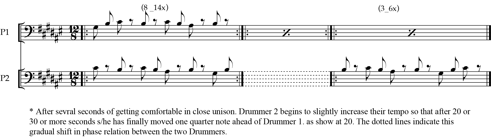
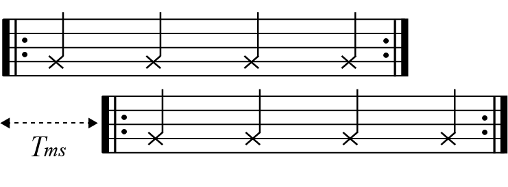
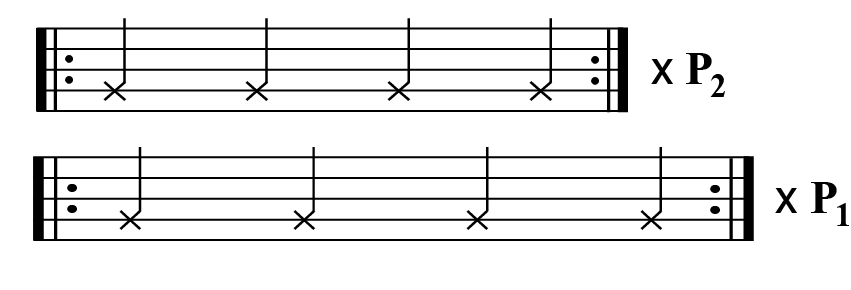
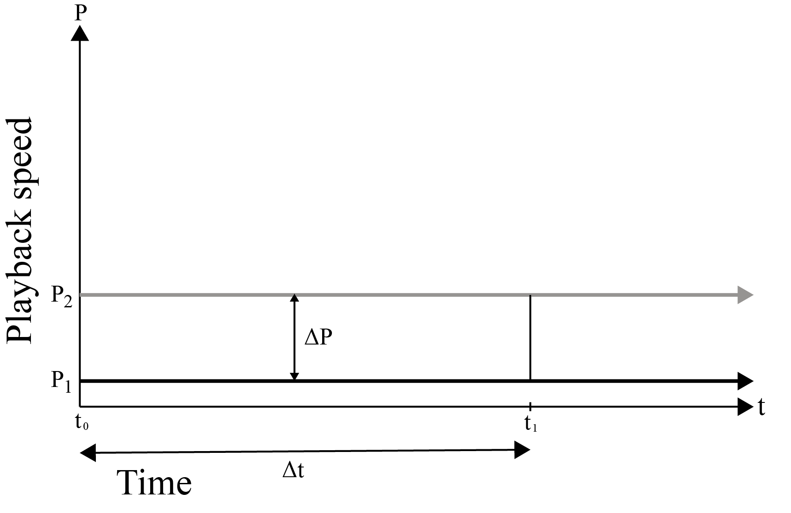
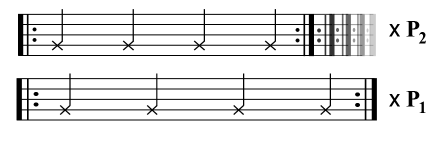
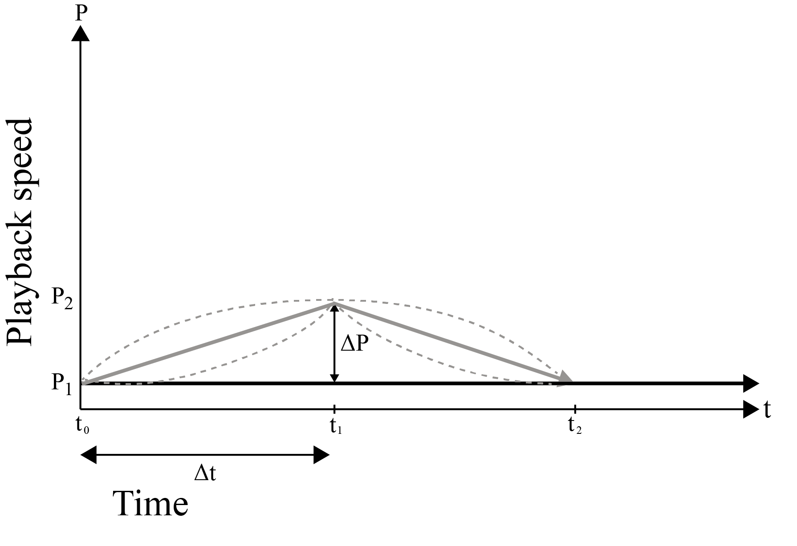
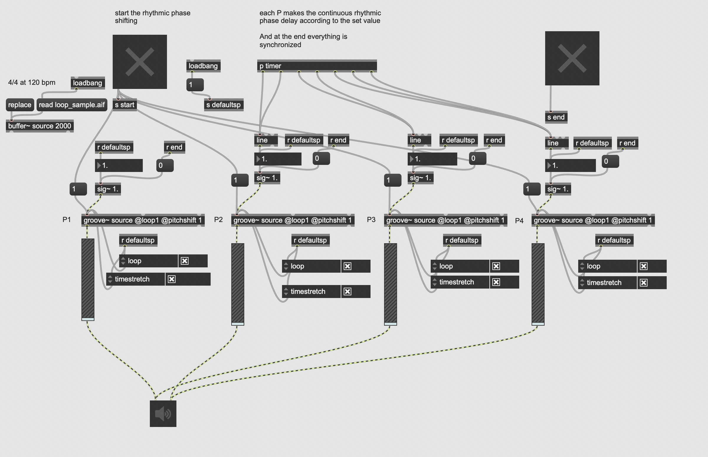
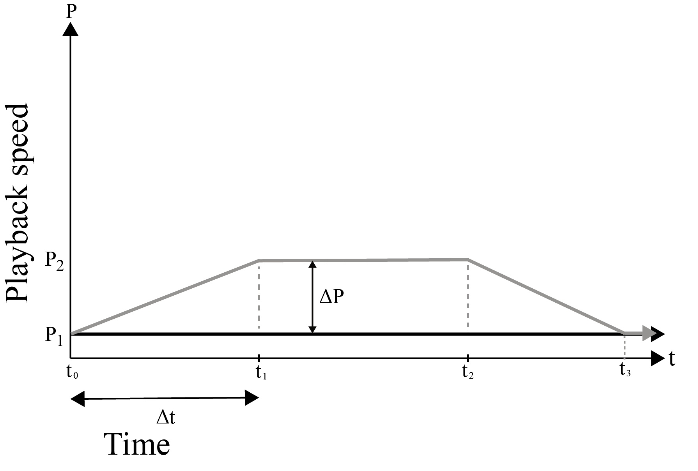

# Introduction

Since classical music has embraced the techniques of counterpoint and harmony, the rhythmic phase-shifting technique of specific phrases or motives has been considered a significant method of composition [1]. There are various works of music in which we can find out examples of this technique. Nevertheless, in the musical context, the classic stretto technique has limitations in regard to its presence in that it cannot function as an entire part of the specific musical section.  The usage of this technique was still restricted as a minor part of the counterpoint technique. However, some modern composers started to expand these methods not as a subcategory of counterpoint music but as a musical mixture itself. It can be found in the works of several minimalist composer’s works such as Steve Reich and John Adams. 


Figure 1.  John Adams -Shaker Loops for String Orchestral [2]

In the case of using these musical phase-shifting techniques mentioned above, composers mainly used phase-shifting in a non-linear manner within traditional rhythm notation. In other words, the phasing intervals are bound to double, triple, quarter, eighth note, or smaller beat units. However, there are a few cases using linear phase-shifting.




Figure 2.  Steve Reich - Drumming [3]


Through the highly rigorous practice of instrument players, the linear phase-shifting technique has been accomplished to some degree, but it still has a limit within the ability of humans’ rhythmic perception and playing technique [4]. In that context, I thought that the potential of this musical technique is much richer when implemented in computer music than in acoustic music. Then, what processes should be used to apply this phasing technique to computer music? 


Basically, if the repetition technique of minimalist voice parts is implemented through the looping of play samples, methods that can create a rhythmic phase between voice parts can be implemented such as sample delay and playback speed. Step-changed phase shifting can be implemented through sample delay, and continuous phase shifting can be implemented through playback speed.
The purpose of this research is to find the computational method for implementing linear and non-linear phase-shifting and musical applications of these by using digital tools and computers.


# Discrete Rhythmic phase-shifting

Discrete phase-shifting can be implemented by making the time interval delay by the corresponding length of the
unit note. This is shown in figure 3.





Figure 3. Discrete rhythmic phase-shifting by one beat (T ms)


Half, triple, quarter and eighth notes are the major units for the delay. 


 * *Suppose we have two audio samples with the same unit Bpm ‘b’, the equation
 for the rhythmic phase delay T ms of i th notes length is as follows.*


```
T = 240000 / b * i 
```

*b; bpm,   i; i th note     


In this case, the musical effect is identical to the example shown in figure 1. For example, the length of a note corresponding to a single quarter note at a speed of 120 bpm is calculated as 500 ms by the above formula. Of course, discrete shifting is possible at any point in time, but considering the musical effect, it is more desirable that the shifting point follows the unit of measure. 

* *Assuming n1/n2 beats of music, the formula for the interval T ms corresponding to one measure is as follows.*


```
T = n1 * 240000 / b * n2 
```
   


Furthermore, using this technique makes it possible to make the phase-shifting with a non-unit interval delay that can be hardly possible by conventional methods such as music written by a score or real-instrument performance. In this case, however, the amount of delay time relative to the corresponding bpm can change the musical phenomenon. It can be perceived as an identical rhythmic 
sound (but delayed) or separated rhythmic notes. There is a critical band of delay time that people can perceive each of the two motives as an individual rhythmic gunit. Fundamentally, it is the same principle as the critical band of pitch frequency. This paper will not cover this critical band in detail.


# Continuous Rhythmic phase-shifting

Continuous phase-shifting can be implemented by the playback speed of each motive or time stretch. In case of this, the time interval of delay can be gradually increased or decreased making a more detailed rhythmic change. This can be found in some acoustical pieces such as Steve Reich’s Drumming shown in figure 2. even though its usage is extremely limited. Generally, this technique requires an amount of practice for players and is even impossible when it goes to the extreme. In order to apply linear phase-shifting in computer music, it is essential to calculate the amount of delay and find out the synchronized point of the delayed sound motive and original sound motive. Otherwise, the phased motives will be placed beyond the composer’s control. There are various ways to implement continuous phase-shifting using time-stretching but this study will focus on a few cases.
 
 

## Continuous rhythmic phase-shifting with a fixed playback speed
 




Figure 4. Continuous rhythmic phase-shifting (fixed playback speed)


The first is a case in which the two looped sounds have different playback speeds that are fixed. In this case, the rhythmic phase of the two motives with different playback speeds is linearly stretched. As a result, the phenomenon in which unsynchronized rhythms are scattered and then synchronized by the length of the unit notes is periodically repeated.  

 




Figure 5.  Continuous rhythmic phase-shifting (fixed playback speed)


The formula for calculating the period in which the phase shifting phase is scattered and synchronized when there is a difference in the playback speed is as follows.


* *Assuming that two sound sources with unit bpm b have playback speed differences ΔP, the period T at which the delay equals the ‘i’th note is as follows. (At this time, the unit of T is ms)*


```
T = 240000 / (b * i * Δp)
```


In this case, a continuous rhythmic delay is accumulated due to the difference in the playback speed of the two motives, and a delay equal to n quarter notes of the unit bpm is accumulated for every multiple of the period T.
This period has an important meaning when designing music with rhythmic phase-shifting techniques. As in discrete rhythmic phase shifting, it is desirable that the duration of rhythmic phase-shifting progression coincides with the unit of measure.


* *The formula for calculating the playback difference ΔP between P1 and P2 required to make a rhythmic phase which has the length of ‘i’th notes while the music is progressing for ’n’th measures in n1/n2 time music with a speed of Bpm b is as follows.*


```
240000 / (b * i) = n * (n1 * 240000 / (b * n2)) * ΔP
```


 encapsulated  as 


```
n2 / (n1 * i * n)
```
 

## Continuous rhythmic phase-shifting with a changing playback speed

 




Figure 6.  Continuous rhythmic phase-shifting (unfixed playback speed)


The second is the case of shifting in which phase-shifting is performed with a delay time as much as a unit rhythm at the point where the playback speed changes continuously and then returns to the original speed. Also, it is desirable that the total duration of the process in which the playback speed changes and then returns to the original value coincides with the duration in units of measure.
In this case, the value obtained by integrating the time difference ΔP between the two playback speeds from the period t0 to t1 where phase shifting is in progress must be designed to match the delay time of the corresponding bpm unit rhythm when the playback speed returns to the origin.

 

```
 240000 / (b * i) = integral( ΔP * dt , t0 , t1)
```
 

Of course, it is possible to make a model in which the playback speed of two or more motives changes simultaneously, but in this paper, the playback speed of the original motive sound file is fixed to x1 and the playback speed of another motive changes linearly. In addition, we deal with specific models only in which the left and right sides are symmetrical based on the point with the maximum amount of playback change.  

 




figure 7. Continuous rhythmic phase-shifting (unfixed playback speed)


A functional model that can continuously change playback speed can take many forms. In this paper,  the form of an f(x) function (linear, exponential, log, or a sine function) that passes through x,y (0, 0), is modulated as b*f(x) or f(a*x) with parameters a and b so that the shape of each function can be adjusted to fit the required artistic demands of the project where it is being used. For instance, the formula for calculating the playback speed that makes a rhythmic phase shift equal to the unit rhythm is as follows.

* *From the starting point t0, with the initial playback speed P1 (as same as (Vm(t0)), in this case, it should be 0), the playback speed passes through the point t1 with the maximum amount of change Vm(t1) and returns to the initial playback speedP2 (as same as (Vm(t2))). (t1-t0 = t2- t1) At this time, the modulated formula Vm(x) that the two sound samples from t0 to t2 have rhythmic phase shifting as much as i th note of the corresponding Bpm b is as follows.* 


```
Vm = ax / b
Vm = b * (e^ax - 1)
Vm = b * ln(a * (x + (1/a)))
Vm = b * (sin((pi * x) / (2 * ΔP)))
```
* *Note that variables a and b can control Playback speed (but one of the two must be fixed as a constant)*


As an example of such a model, I used the natural log function for the test. At a speed of 120BPM with 4/4, if the variable ‘a’ is fixed to 1 and continuous playback speed modulation is performed for a total of 8 measures,(4 measures of increase, and 4 measures of decrease curve) In order to obtain a rhythmic phase delay equal to the quarter note of the music, the value of parameter b is calculated to be approximately 0.0212314, and the maximum playback speed of modulated motive sample is calculated to be approximately1.0466051. The formula used to create a symmetric structure based on the progression of 4 measures is as follows. This model can be programmed By using MaxMsp. The ‘line’ object is mainly for the linear model, and the ‘groove’ object is for time-stretching and adjusting the playback speed.

 

```
y= 0.0212314*ln(x+1)   from 0-8s
y= 0.0212314*ln(17-x)  from 8-16s
```
 

The figure below shows an example patch's structure based on the parameter value and formula derived above with the buffer and groove object of MaxMsp.

 




Figure 9. max patch for rhythmic phase-shifting


In general, when manipulating the playback speed, the pitch of the sample audio changes as well. Therefore, in order to obtain a pure rhythmic phase-shifting effect without changing the pitch of the samples, time-stretch mode should be applied to the file where the playback speed is changed, but the phenomenon that the pitch changes as the playback speed changes can also be used as part of the musical intention. The adaptation of a technique between those two is up to the context and intent of the composer.


## Mixed usage of the changed playback speed and fixed playback speed for rhythmic phase-shifting


Finally, the two rhythmic phase shifting methods discussed in 3-1 and 3-2 above can be used in combination. In this case, the playback speed of one of the two identical motives may change continuously, maintain the peak value for a certain amount of time, and then return to the original value continuously.

 




Figure 10. Continuous rhythmic phase shifting (mixed use of fixed and variable playback speed)

In addition, it is possible to create more complex musical effects by using different shifting models for two or more motives This could be the musical goal of this technique.


# Conclusion

Through several methods shown above, we looked at both the calculation and examples to implement these rhythmic phase-shifting techniques in a computational way. The techniques include discrete phase-shifting through sample delay, continuous phase-shifting using fixed and linear speed change of playback speed, and mixed-use of these various methods. Furthermore, this study presents musical possibilities of computational rhythmic phase-shifting through practical implementations of those techniques. These techniques can be useful musical tools for composers in the field of computer music.


# Referennces


[1]. Magnusson, Thor, and Alex McLean. “Performing with Patterns of Time." (2018). pp 3- 4

[2]. Reich, Steve. Drumming for voice and ensemble( 1970-71), Boosey & Hawkes (Hendon Music), mm 11-12

[3]. Adams, John.  Shaker Loops for String Orchestral Score (1982 Revised), Boosey & Hawkes (Hendon Music) mm 71-12

[4]. Schutz, Michael. "What Really Happens in Steve Reich’s “Drumming”?." PERCUSSIVE NOTES (2019): 87. pp 1-2

